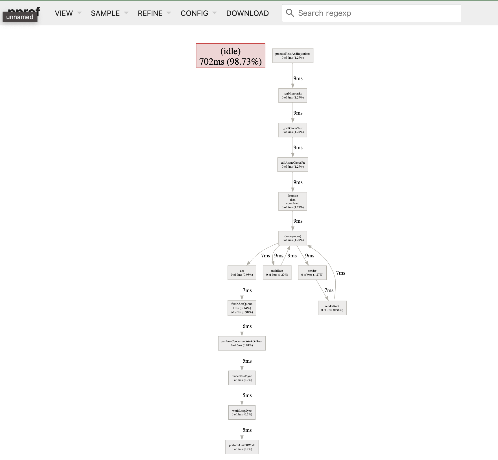

# Hello [pprof-nodejs](https://github.com/google/pprof-nodejs)

## テスト

```shell
npm test
```

Launches the test runner in the interactive watch mode.

## 可視化

```shell
pprof -http=: wall.pb.gz
```


